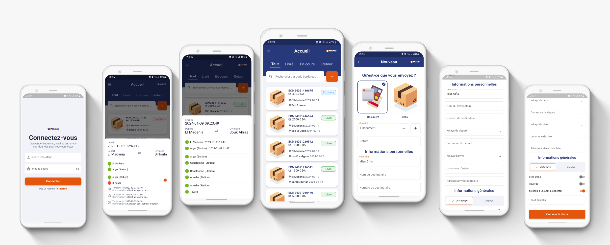

# Mars Customer (ANDROID , IOS):

**Mars Express Customer** is a Flutter application that i developed ( flutter for the frontend + some backend code using php/symfony ) to streamline parcel management for Mars Express users, particularly eCommerce store owners. This app offers the following features:

- **Parcel Creation**: Users can effortlessly create new parcels by entering essential information such as starting point, destination, and parcel cost. The app calculates and displays the delivery price based on the provided information.

- **Parcel Management**: Users can accept or cancel parcel deliveries as needed, empowering them with flexibility in managing their logistics operations.

- **Parcel Tracking**: Mars Express Customer provides comprehensive parcel tracking, allowing users to monitor the status of each delivery. Users can track parcel codes and their respective statuses (e.g., all, arrived, failed) in real-time, along with information on the current station location (province).

- **Driver Comments**: In cases where a delivery fails, users can access comments left by the driver, providing insights into the reason for the failure.

# Used Packages

This project utilizes the following Flutter packages:

- get (getx)
- lottie
- flutter_svg
- dio
- dotted_line
- loading_indicator
- flutter_launcher_icons
- flutter_native_splash
- shared_preferences
- dropdown_button2
- internet_connection_checker_plus
- connectivity_plus

## screenshots :

